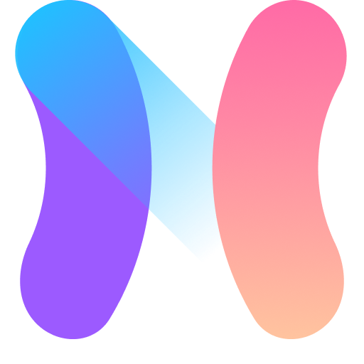

<div style='display:flex; flex-direction:column; align-items:center; text-align:center;'>
  

  <h3 style='font-size:32px;'>Marketplace API</h3>

  <p style='width:80%'>Marketplace-api-hub es una API centralizada diseñada para facilitar la integración y gestión de múltiples API de Marketplace en una sola plataforma. Simplifica el proceso de desarrollo y mantenimiento al proporcionar una interfaz unificada para acceder a funciones comunes de diferentes marketplaces, permitiendo a los desarrolladores construir aplicaciones y servicios que interactúen con diversos mercados en línea de manera eficiente.</p>
</div>

## 🚀 Comenzando

Instrucciones para comenzar con el proyecto.

### 📋 Prerequisitos

Asegúrate de tener instalados los siguientes requisitos:

- Node.js
- npm
- ...

### 🔧 Instalación

Sigue estos pasos para instalar y ejecutar el proyecto:

1. Clona este repositorio.

   ```bash
   git clone https://github.com/tu-usuario/Marketplace-api-hub.git
   cd Marketplace-api-hub
   ```

2. Instala las dependencias.

   ```bash
   npm install
   ```

3. Configura las variables de entorno.

   ```bash
   cp .env.example .env
   ```

   Ajusta las variables de entorno según sea necesario.

4. Inicia la aplicación.

   ```bash
   npm start
   ```

   La aplicación estará disponible en [http://localhost:3000](http://localhost:3000).

## 🛠️ Desarrollo

Marketplace-api-hub está diseñado para ser una solución flexible y fácil de usar. Consulta nuestra documentación para obtener detalles sobre la estructura del código, pautas de desarrollo y flujos de trabajo recomendados.

## 🤝 Contribuir

¡Agradecemos cualquier contribución! Sigue nuestros pasos para contribuir:

1. Haz un fork del proyecto.
2. Crea una nueva rama para tu función/bugfix.
3. Realiza tus cambios y envía un pull request.

Asegúrate de seguir nuestras pautas de contribución.

## 📄 Licencia

Este proyecto está bajo la Licencia MIT. Consulta el archivo [LICENSE.md](LICENSE.md) para obtener más detalles.
